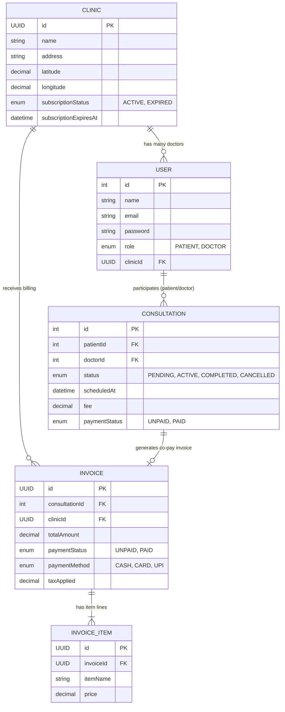

# MediSync: B2B2C Telehealth & Clinical POS SaaS Platform

## Professional Reference Manual & Architecture Blueprint

MediSync is a B2B2C multi-tenant SaaS platform that merges consumer-facing local clinic discovery ("Swiggy for Clinics"), live virtual consultation rooms, clinical SOAP scribing, and a Point of Sale (POS) register.

This document serves as the absolute technical guide for developers, system architects, and AI models to understand, deploy, and extend the codebase.

---

## 📂 1. Directory Structure Layout

Below is the directory tree of the complete workspace, mapping the separation of concerns:

```text
doctor-patient-consultation-fullstack/
├── backend/
│   ├── src/
│   │   ├── config/
│   │   │   └── database.js               # SQLite connection & DB configs
│   │   ├── controllers/
│   │   │   ├── appointment.controller.js  # Row-locked booking transaction
│   │   │   ├── consultation.controller.js # SOAP updates & status endpoints
│   │   │   ├── discovery.controller.js   # Swiggy-rule geolocation search
│   │   │   └── pos.controller.js         # Invoice generation & payment log
│   │   ├── middleware/
│   │   │   ├── auth.middleware.js        # JWT token verifier
│   │   │   └── role.middleware.js        # RBAC role restriction
│   │   ├── models/
│   │   │   ├── clinic.model.js           # Clinic coordinates & subscription status
│   │   │   ├── user.model.js             # User accounts (Patient vs Doctor)
│   │   │   ├── consultation.model.js     # Virtual session metadata
│   │   │   ├── invoice.model.js          # POS transaction record
│   │   │   ├── invoiceItem.model.js      # Cart item line detail
│   │   │   └── index.js                  # Model mappings and Sequelize hooks
│   │   ├── routes/
│   │   │   ├── appointment.routes.js     # /appointments route definitions
│   │   │   ├── discovery.routes.js       # /discovery search router
│   │   │   └── pos.routes.js             # /pos/invoices billing & renewal routes
│   │   └── app.js                        # App setup & route mounting
│   ├── database.sqlite                   # SQLite database file
│   ├── seed.js                           # Seeding module
│   └── package.json
└── frontend/
    ├── src/
    │   ├── api.js                        # Axios API endpoints declarations
    │   ├── App.jsx                       # Routing table and layout wrapper
    │   ├── index.css                     # Design tokens & responsive styles
    │   └── pages/
    │       ├── Dashboard.jsx             # Appointments panel & stripe copay checkout
    │       ├── Discovery.jsx             # Location marketplace search
    │       ├── POSTerminal.jsx           # Register cart catalog
    │       ├── POSCheckout.jsx           # Cash, Card, UPI terminal options
    │       ├── ConsultationRoom.jsx      # Telehealth video room & Speech scribe
    │       └── Settings.jsx              # Tab configs & Subscription renewal
```

---

## 🗄️ 2. Database Schema & Relationships (Entity Relationship List)

All schemas use UUID v4 values for multi-tenant isolation, ensuring portability to production databases (e.g., PostgreSQL).



---

## 🔌 3. Complete REST API Specifications

### A. Geolocation Clinic Discovery Marketplace

* **Endpoint:** `GET /discovery/search`
* **Query Parameters:**
  * `lat` (Float, Required) - Center latitude coordinate.
  * `lng` (Float, Required) - Center longitude coordinate.
  * `radius` (Float, Optional, Default: `10`) - Search boundary in kilometers.
* **Controller Logic:**
  Performs bounding-box calculations to filter clinics within the given geographic area. Limits search results **exclusively** to clinics with an `ACTIVE` subscription status.

  ```javascript
  const latDelta = radius / 111;
  const lngDelta = radius / (111 * Math.cos(lat * Math.PI / 180));
  ```

  Returns matching clinics, associated doctors, and their live shift slot arrays.

### B. Race-Condition Proof Booking Engine

* **Endpoint:** `POST /appointments/book`
* **Headers:** `Authorization: Bearer <JWT_TOKEN>`
* **Body:**

  ```json
  {
    "doctorId": 1,
    "scheduledAt": "2026-07-17T09:00:00.000Z",
    "paymentStatus": "PAID",
    "fee": 15.00
  }
  ```

* **Controller Logic:**
  Runs inside a Sequelize transaction block. Enforces a row-level lock (`t.LOCK.UPDATE`) on search queries to ensure that if two concurrent requests attempt to reserve the same slot at the exact same millisecond, the database handles them sequentially and rejects the second request.

  ```javascript
  const existing = await Consultation.findOne({
    where: { doctorId, scheduledAt, status: { [Op.notIn]: ['CANCELLED'] } },
    lock: t.LOCK.UPDATE,
    transaction: t
  });
  if (existing) throw new Error('SLOT_OCCUPIED');
  ```

### C. POS Invoice Generation

* **Endpoint:** `POST /pos/invoices/generate`
* **Headers:** `Authorization: Bearer <JWT_TOKEN>`
* **Body:**

  ```json
  {
    "consultationId": 2,
    "patientName": "Walk-in Patient",
    "items": [
      { "itemName": "Blood CBC Panel", "price": 35.00 },
      { "itemName": "Amoxicillin 500mg", "price": 12.00 }
    ],
    "discount": 5.00
  }
  ```

* **Controller Logic:**
  Computes the 5% flat healthcare tax on the subtotal, subtracts discounts, creates an `Invoice` record linked to the practitioner's clinic, bulk-creates the `InvoiceItem` lines, and returns the compiled invoice.

### D. Subscription Validation Middleware

* **Active Check:** Registered on all POS routes.

  ```javascript
  const clinic = await Clinic.findByPk(req.user.clinicId);
  const isExpired = new Date(clinic.subscriptionExpiresAt) < new Date();
  if (clinic.subscriptionStatus !== 'ACTIVE' || isExpired) {
    return res.status(402).json({ success: false, message: 'Subscription expired.' });
  }
  ```

### E. Subscription Renewal

* **Endpoint:** `POST /pos/invoices/renew`
* **Headers:** `Authorization: Bearer <JWT_TOKEN>`
* **Controller Logic:**
  Bypasses the validation check to allow expired clinics to recover. Extends the clinic's `subscriptionExpiresAt` date by `30 days` and sets `subscriptionStatus` to `'ACTIVE'`.

---

## 🖥️ 4. Frontend Application Workflow & Component Manual

### A. Geolocation Discovery Marketplace ([Discovery.jsx](file:///C:/Users/nikun/OneDrive/Desktop/doctor-patient-consultation-fullstack/frontend/src/pages/Discovery.jsx))

* **Visuals**: Features center lat/lng inputs, a range slider for radius, and an instant "Detect GPS" button.
* **State Management**:
  * `clinics`: Stores the array of nearby clinics fetched from the discovery API.
  * `selectedDoctor` & `selectedSlot`: Manages the wizard state for booking a slot directly from the search list.
* **Defensive Rendering**: Implements optional chaining (`clinic.doctors?.map()`) and `Array.isArray()` fallbacks to prevent runtime crashes.

### B. Point of Sale checkout overlay ([POSCheckout.jsx](file:///C:/Users/nikun/OneDrive/Desktop/doctor-patient-consultation-fullstack/frontend/src/pages/POSCheckout.jsx))

* **Visuals**: Modern checkout overlay detailing subtotal, taxes, discounts, and final price.
* **Interactive Panels**:
  * **Cash**: Instructs the clerk to collect cash at the counter before completing.
  * **Card**: Triggers a simulated terminal card-tap or card-insert visual.
  * **UPI QR**: Renders a simulated QR code frame for UPI scanner checks.
* **Integrations**: On payment success, issues the API call to flag the invoice status as `PAID`, triggers receipt printing, and resets the billing workspace.

### C. Live Telehealth Consult Scribe ([ConsultationRoom.jsx](file:///C:/Users/nikun/OneDrive/Desktop/doctor-patient-consultation-fullstack/frontend/src/pages/ConsultationRoom.jsx))

* **Device Access**: Initializes video/audio streams on mount:

  ```javascript
  navigator.mediaDevices.getUserMedia({ video: true, audio: true })
  ```

* **SOAP Speech Dictation**: Employs the browser HTML5 Web Speech API (`webkitSpeechRecognition`) to transcribe doctor voice inputs directly into SOAP fields (Subjective, Objective, Assessment, Plan).
* **Autocomplete**: Integrates a client-side drug database (e.g. Amoxicillin, Metformin) to suggest dosage matches as the doctor types.

### D. Settings & SaaS Renewals ([Settings.jsx](file:///C:/Users/nikun/OneDrive/Desktop/doctor-patient-consultation-fullstack/frontend/src/pages/Settings.jsx))

* **Tab Controls**: Renders personal settings (`Account Details`) for everyone.
* **Patient Settings**: Displays fields to log allergies, blood group, height, and weight.
* **Doctor Settings**: Displays a shift scheduler grid (working days checkboxes, shift timings, slot times, and break buffers).
* **Clinic Premium Panel**: Displays seats and consult volumes, alongside a **"Renew Subscription"** button linked directly to the renewal API endpoint.

---

## 📈 5. POS B2B SaaS Expansion Blueprint (AI-Injectable Prompt)

Copy and paste this section to an AI assistant (like Claude) to implement the next development phase:

```text
Please read the following database structure for MediSync:
- Clinic (id, name, lat, lng, subscriptionStatus, subscriptionExpiresAt)
- User (id, name, email, role, clinicId)
- Invoice (id, consultationId, clinicId, totalAmount, paymentStatus, paymentMethod, taxApplied)
- InvoiceItem (id, invoiceId, itemName, price)

Help me build the next phase of our Clinical POS SaaS:
1. INVENTORY: Create a Product model (id, clinicId, name, sku, stockCount, retailPrice) using UUID keys. Add a router endpoint `POST /pos/inventory` to update stock levels.
2. STOCK DEDUCTION: In our `payInvoice` controller endpoint inside pos.controller.js, wrap a transaction block that deducts the stockCount of any Product matching the item names present in the checkout invoice.
3. ALERTS: Return a warning header on the POS API response if any product stock level falls below 5 items.
4. ANALYTICS LEDGER: Add a route `GET /pos/analytics/daily-sales` that returns the aggregate daily transaction totals grouped by payment method (CASH, CARD, UPI).
```
